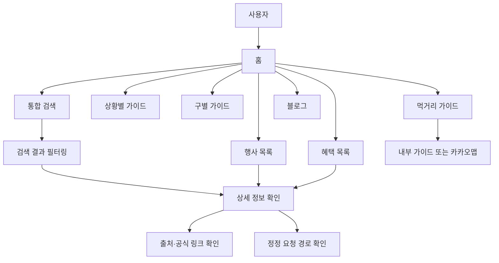
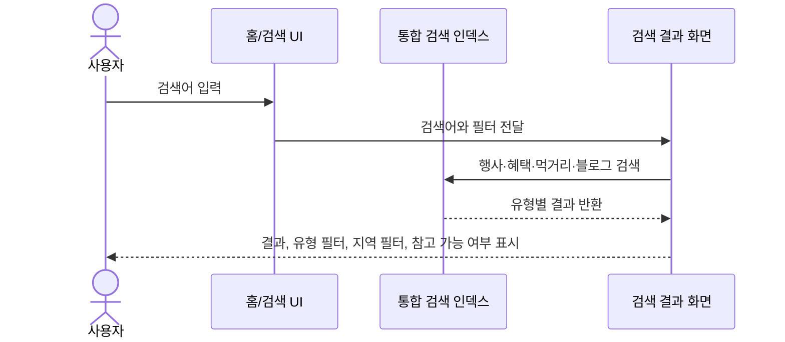
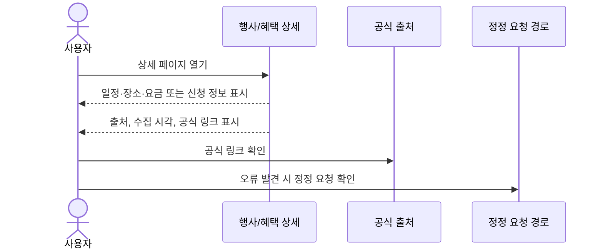
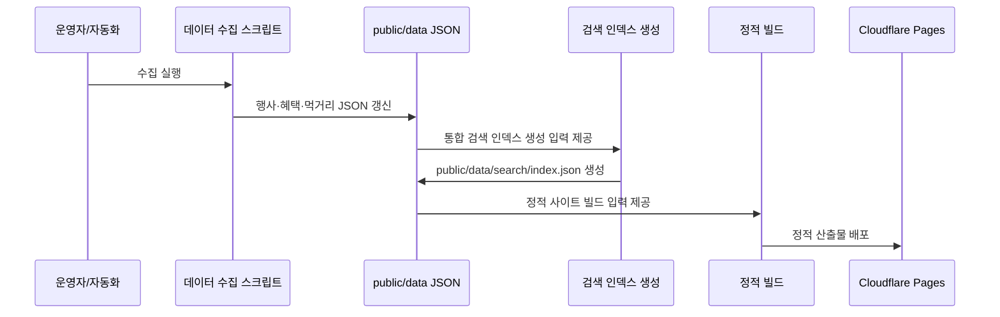
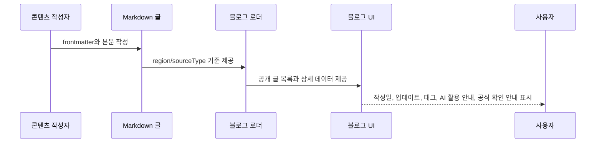
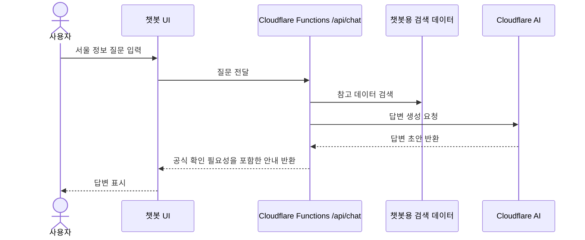
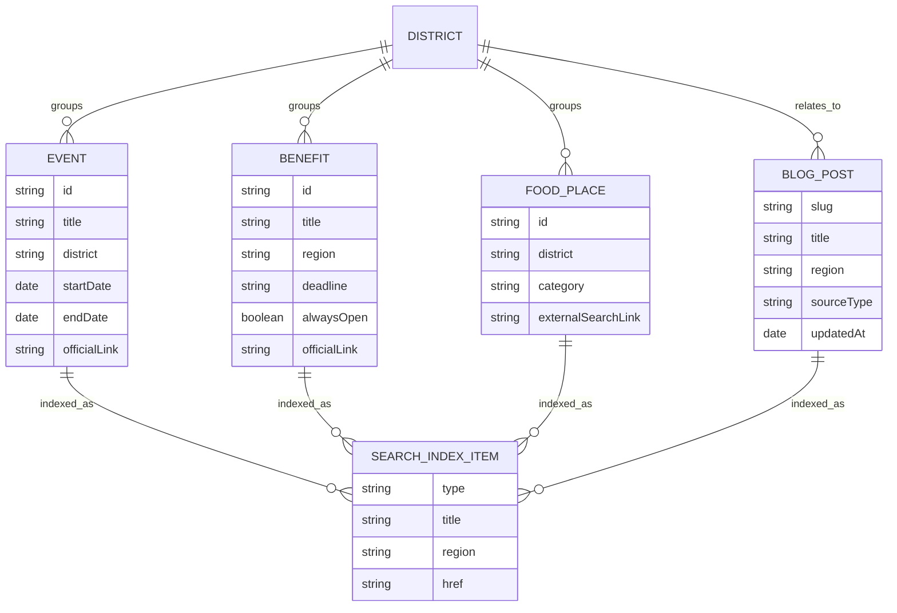

# 서울시티 SRS

## 1. Document Control

| 항목 | 내용 |
| --- | --- |
| Source PRD path | `docs/prd/seoulcity_prd.md` |
| Generated date | 2026-05-21 |
| Output path | `docs/srs/seoulcity_srs.md` |
| Status | Draft |

## 2. References

- `docs/prd/seoulcity_prd.md`: 제품 범위, 사용자, 목표, 요구사항의 기준 문서
- `README.md`: 프로젝트 구조와 실행·배포 맥락을 확인하기 위한 보조 문서
- `.agent/workflow/prd_to_srs_prompt.md`: 이 SRS의 생성 기준 워크플로우

이 문서는 PRD를 제품 요구사항의 source of truth로 사용합니다. README와 워크플로우 문서는 저장 위치와 프로젝트 맥락을 확인하는 용도로만 참조했습니다.

## 3. Purpose and Scope

### 3.1 Purpose

서울시티 SRS의 목적은 서울시티 PRD의 제품 요구사항을 구현·검증 가능한 소프트웨어 요구사항으로 구조화하는 것입니다. 이 문서는 기능, 데이터, 인터페이스, 비기능 요구사항, 제약조건, 검증 계획, 추적성을 정리해 향후 구현·문서·검토 작업의 기준으로 사용합니다.

### 3.2 In Scope

- 홈, 행사, 혜택, 먹거리, 구별 가이드, 상황별 가이드, 블로그, 통합 검색, 운영 고지, 챗봇
- 서울 행사, 공공 혜택, 먹거리, 검색 인덱스 JSON 데이터
- Markdown 기반 블로그 정보글
- 공식 링크, 출처, 수집 시각, 정정 요청 경로
- 정적 사이트 배포, 검색 인덱스 생성, 기본 SEO와 신뢰 요구사항
- 한국어 UI 문구와 공공정보 안전 표현

### 3.3 Out of Scope

- 예약, 결제, 신청 대행
- 사용자 계정과 개인화 추천
- 실시간 위치 기반 추천
- 공공기관 원문을 대체하는 법적·행정적 안내
- 모든 서울 25개 구에 대한 동일 수준의 에디토리얼 가이드 보장
- 실시간 데이터 조회형 애플리케이션

## 4. Product Context

### 4.1 User Groups

- 서울에서 주말이나 퇴근 후 갈 곳을 찾는 사용자
- 아이와 갈 만한 장소를 찾는 보호자
- 비 오는 날 실내 코스나 무료·저비용 코스를 찾는 사용자
- 서울시 또는 자치구 공공 혜택을 놓치고 싶지 않은 사용자
- 특정 구를 기준으로 행사, 혜택, 먹거리를 함께 보고 싶은 사용자
- 사이트 운영자와 데이터·콘텐츠 갱신을 관리하는 개발자
- 잘못된 정보나 오래된 정보를 제보하려는 사용자

### 4.2 Operating Context

서울시티는 Next.js App Router 기반 정적 사이트로 운영됩니다. 콘텐츠는 공공 데이터 JSON과 Markdown 블로그 글을 함께 사용하며, Cloudflare Pages 배포를 기준으로 합니다. 사용자는 상황별, 구별, 검색 기반 탐색을 통해 서울 생활 정보를 비교하고, 상세 페이지에서 공식 링크와 출처를 확인할 수 있어야 합니다.

### 4.3 Relevant Surfaces

- 홈: 서비스 목적, 통합 검색, 상황별 코스, 추천 글, 오늘의 서울 요약, 행사·혜택 하이라이트
- 행사: 행사 목록, 프리셋, 구별 필터, 행사 상세
- 혜택: 혜택 목록, 분야·지역 필터, 이번 주 마감 혜택, 혜택 상세
- 먹거리: 구별 먹거리 개요, 내부 상세 가이드, 카카오맵 연결, 공공데이터 후보 안내
- 구별 가이드: 주요 권역, 반나절 코스, 연결 행사·혜택·블로그·먹거리, 공식 확인 링크
- 상황별 가이드: 판단 기준, 체크리스트, 관련 글, 통합 검색 링크
- 블로그: Markdown 글 목록과 상세, AI 활용 안내, 공식 확인 안내
- 통합 검색: 행사, 혜택, 먹거리, 블로그 통합 검색과 필터
- 운영 고지: 소개, 개인정보처리방침, 서비스 안내, 광고·분석 고지, 문의 및 정정 요청
- 챗봇: Cloudflare AI 기반 간단한 서울 정보 도우미

## 5. Definitions

| 용어 | 정의 |
| --- | --- |
| 행사 | 서울 열린데이터광장 문화행사 정보를 기반으로 제공하는 서울 행사·축제 항목 |
| 혜택 | 공공데이터포털 대한민국 공공서비스 정보 중 서울시·자치구·서울 공공기관 관련 지원금·혜택 항목 |
| 먹거리 후보 | 서울 열린데이터광장 일반음식점 인허가 정보를 기반으로 정리한 참고용 음식점 후보 |
| 구별 가이드 | 특정 서울 자치구의 주요 권역, 코스 예시, 연결 정보, 공식 링크를 제공하는 가이드 |
| 상황별 가이드 | 아이와, 비 오는 날, 무료·저비용 같은 상황 기준으로 정보를 묶은 가이드 |
| 통합 검색 | 행사, 혜택, 먹거리, 블로그 정보글을 하나의 검색 경험에서 찾는 기능 |
| 공식 링크 | 원천 공공기관 또는 관련 공식 안내로 이동하는 링크 |
| 정정 요청 | 오래되거나 잘못된 정보에 대해 사용자가 수정 요청을 보내는 경로 |
| 공개 글 | `region: 서울`, `sourceType: 정보글` 기준을 만족해 블로그에 노출되는 Markdown 글 |
| 정적 배포 | 서버 런타임 의존 없이 빌드된 정적 산출물을 배포하는 운영 방식 |

## 6. Functional Requirements

### 6.1 홈

| ID | Requirement statement | Source PRD section | Priority | Verification method | Acceptance criteria |
| --- | --- | --- | --- | --- | --- |
| REQ-FUNC-001 | 홈은 사용자가 서울시티의 목적을 바로 이해할 수 있는 소개 메시지를 표시해야 한다. | 8.1 | Must | Review | 홈 상단에서 서비스 목적과 서울 생활 정보 탐색 가치가 한국어로 명확히 표현된다. |
| REQ-FUNC-002 | 홈은 상단에서 행사, 혜택, 먹거리, 블로그를 함께 찾는 통합 검색 입력창을 제공해야 한다. | 8.1, 6.4 | Must | Test | 홈에서 검색어를 입력해 통합 검색 결과 화면으로 이동할 수 있다. |
| REQ-FUNC-003 | 홈은 상황별 코스, 추천 글, 오늘의 서울 요약, 행사·혜택 하이라이트를 표시해야 한다. | 8.1, 7 | Must | Inspection | 홈에 네 영역이 모두 표시되고 각 영역이 관련 탐색 경로로 연결된다. |
| REQ-FUNC-004 | 홈은 오늘 진행 중인 행사, 무료 행사, 실내 추천, 이번 주 마감 혜택처럼 빠른 탐색 단서를 제공해야 한다. | 6.1 | Should | Review | 사용자가 홈에서 오늘 또는 이번 주 기준으로 볼 만한 정보를 찾을 수 있다. |

### 6.2 행사

| ID | Requirement statement | Source PRD section | Priority | Verification method | Acceptance criteria |
| --- | --- | --- | --- | --- | --- |
| REQ-FUNC-005 | 사용자는 서울 행사·축제 목록을 볼 수 있어야 한다. | 8.2 | Must | Test | 행사 목록 페이지가 수집된 행사 항목을 표시한다. |
| REQ-FUNC-006 | 사용자는 진행 중, 무료, 실내 추천 프리셋으로 행사 목록을 좁힐 수 있어야 한다. | 8.2 | Must | Test | 각 프리셋 선택 시 조건에 맞는 행사 목록이 표시된다. |
| REQ-FUNC-007 | 사용자는 구별 필터로 행사를 탐색할 수 있어야 한다. | 8.2 | Must | Test | 구 선택 시 해당 구와 관련된 행사만 확인할 수 있다. |
| REQ-FUNC-008 | 행사 상세는 일정, 장소, 요금, 문의, 출처, 공식 링크를 표시해야 한다. | 8.2, 6.5 | Must | Inspection | 행사 상세에서 모든 필수 상세 정보와 공식 확인 경로가 보인다. |

### 6.3 혜택

| ID | Requirement statement | Source PRD section | Priority | Verification method | Acceptance criteria |
| --- | --- | --- | --- | --- | --- |
| REQ-FUNC-009 | 사용자는 서울시와 자치구, 서울 공공기관 관련 혜택 목록을 볼 수 있어야 한다. | 8.3 | Must | Test | 혜택 목록 페이지가 수집된 서울 관련 혜택을 표시한다. |
| REQ-FUNC-010 | 사용자는 분야와 지역으로 혜택을 필터링할 수 있어야 한다. | 8.3 | Must | Test | 분야 또는 지역 선택 시 조건에 맞는 혜택 목록이 표시된다. |
| REQ-FUNC-011 | 사용자는 이번 주 마감 혜택을 빠르게 볼 수 있어야 한다. | 8.3, 6.1 | Should | Test | 이번 주 마감 기준의 혜택 탐색 경로가 제공된다. |
| REQ-FUNC-012 | 혜택 상세는 지원 대상, 신청 기한, 신청 방법, 지원 내용, 문의처, 공식 링크를 표시해야 한다. | 8.3, 6.5 | Must | Inspection | 혜택 상세에서 신청 판단에 필요한 필수 정보와 공식 확인 경로가 보인다. |

### 6.4 먹거리

| ID | Requirement statement | Source PRD section | Priority | Verification method | Acceptance criteria |
| --- | --- | --- | --- | --- | --- |
| REQ-FUNC-013 | 사용자는 서울 구별 먹거리 개요를 볼 수 있어야 한다. | 8.4 | Must | Test | 먹거리 페이지가 구별 먹거리 탐색 정보를 표시한다. |
| REQ-FUNC-014 | 상세 가이드가 있는 구는 내부 상세 페이지로 이동할 수 있어야 한다. | 8.4 | Must | Test | 상세 가이드가 있는 구의 링크가 내부 페이지로 연결된다. |
| REQ-FUNC-015 | 상세 가이드가 없는 구는 카카오맵 검색으로 연결할 수 있어야 한다. | 8.4 | Must | Test | 상세 가이드가 없는 구의 링크가 외부 검색으로 안전하게 연결된다. |
| REQ-FUNC-016 | 음식점 후보는 추천 순위가 아니라 공공데이터 기반 참고 후보임을 명확히 알려야 한다. | 8.4, 9, 10 | Must | Review | 먹거리 후보 영역에 추천이 아닌 참고 정보라는 안내가 표시된다. |

### 6.5 구별·상황별 가이드

| ID | Requirement statement | Source PRD section | Priority | Verification method | Acceptance criteria |
| --- | --- | --- | --- | --- | --- |
| REQ-FUNC-017 | 구별 가이드는 주요 권역과 반나절 코스 예시를 제공해야 한다. | 8.5, 6.3 | Must | Inspection | 구별 상세에서 권역 설명과 코스 예시를 확인할 수 있다. |
| REQ-FUNC-018 | 구별 가이드는 해당 구와 연결되는 행사, 혜택, 블로그 글, 먹거리 정보를 함께 제공해야 한다. | 8.5, 6.3 | Must | Inspection | 구별 상세에서 관련 정보 묶음이 함께 표시된다. |
| REQ-FUNC-019 | 구별 가이드는 구별 공식 확인 링크를 제공해야 한다. | 8.5, 6.5 | Must | Inspection | 구별 상세에서 공식 확인 링크가 보인다. |
| REQ-FUNC-020 | 상황별 가이드는 아이와, 비 오는 날, 무료·저비용 같은 상황별 페이지를 제공해야 한다. | 8.6, 6.2 | Must | Test | 각 상황별 페이지가 접근 가능하다. |
| REQ-FUNC-021 | 상황별 페이지는 판단 기준, 체크리스트, 관련 글, 통합 검색 링크를 포함해야 한다. | 8.6 | Must | Inspection | 상황별 상세에서 네 요소가 모두 표시된다. |

### 6.6 블로그

| ID | Requirement statement | Source PRD section | Priority | Verification method | Acceptance criteria |
| --- | --- | --- | --- | --- | --- |
| REQ-FUNC-022 | 사용자는 Markdown 기반 서울 생활 정보 블로그 목록을 볼 수 있어야 한다. | 7, 8.7 | Must | Test | 블로그 목록에서 공개 기준을 만족한 글이 표시된다. |
| REQ-FUNC-023 | 블로그 상세는 작성일, 최종 업데이트, 카테고리, 태그를 표시해야 한다. | 8.7 | Must | Inspection | 블로그 상세 헤더에서 네 가지 메타데이터를 확인할 수 있다. |
| REQ-FUNC-024 | 블로그 상세는 AI 활용 안내와 공식 확인 안내를 표시해야 한다. | 8.7, 10 | Must | Review | 블로그 상세 하단 또는 관련 영역에 AI 활용과 공식 확인 필요성이 안내된다. |

### 6.7 통합 검색

| ID | Requirement statement | Source PRD section | Priority | Verification method | Acceptance criteria |
| --- | --- | --- | --- | --- | --- |
| REQ-FUNC-025 | 사용자는 하나의 검색어로 행사, 혜택, 먹거리, 블로그 정보글을 함께 찾을 수 있어야 한다. | 8.8, 6.4 | Must | Test | 하나의 검색 결과 화면에서 네 콘텐츠 유형의 결과를 확인할 수 있다. |
| REQ-FUNC-026 | 검색 결과는 유형, 지역, 현재 참고 가능 여부로 필터링할 수 있어야 한다. | 8.8 | Must | Test | 검색 결과에서 유형·지역·참고 가능 여부 필터가 동작한다. |
| REQ-FUNC-027 | 먹거리 결과처럼 외부로 이동하는 검색 결과는 외부 링크임을 안전하게 처리해야 한다. | 8.8 | Must | Inspection | 외부 이동 링크는 외부 링크 속성과 안전한 새 창 처리를 갖춘다. |

### 6.8 운영 고지와 정정 요청

| ID | Requirement statement | Source PRD section | Priority | Verification method | Acceptance criteria |
| --- | --- | --- | --- | --- | --- |
| REQ-FUNC-028 | 사용자는 서비스 소개, 개인정보처리방침, 서비스 안내, 광고·분석 고지, 문의 및 정정 요청 페이지에 접근할 수 있어야 한다. | 8.9 | Must | Test | 각 운영 고지 페이지가 링크와 직접 URL로 접근 가능하다. |
| REQ-FUNC-029 | 정정 요청 경로는 개인정보가 섞일 수 있는 요청과 공개 오류 제보를 구분해야 한다. | 8.9 | Must | Review | 문의/정정 안내에서 개인정보 포함 요청과 공개 제보의 주의사항이 분리되어 안내된다. |

### 6.9 챗봇

| ID | Requirement statement | Source PRD section | Priority | Verification method | Acceptance criteria |
| --- | --- | --- | --- | --- | --- |
| REQ-FUNC-030 | 서비스는 Cloudflare AI 기반 간단한 서울 정보 도우미 챗봇을 제공해야 한다. | 7 | Should | Test | 챗봇 UI가 접근 가능하고 서울 정보 안내 목적에 맞게 동작한다. |
| REQ-FUNC-031 | 챗봇은 공공기관 원문을 대체하는 확정적 안내를 제공하지 않아야 한다. | 7, 10 | Must | Review | 챗봇 안내 문구 또는 응답 정책이 공식 확인 필요성을 보존한다. |

## 7. Non-Functional Requirements

| ID | Requirement statement | Source PRD section | Priority | Verification method | Acceptance criteria |
| --- | --- | --- | --- | --- | --- |
| REQ-NF-001 | 서비스는 정적 배포 구조를 유지해야 한다. | 4, 12 | Must | Analysis | 일반 페이지가 정적 산출물로 배포 가능한 구조를 유지한다. |
| REQ-NF-002 | 빌드 전 통합 검색 인덱스를 생성해야 한다. | 12 | Must | Test | 빌드 흐름에서 검색 인덱스 생성 단계가 선행된다. |
| REQ-NF-003 | 외부 API 키가 없어도 일반 개발과 정적 페이지 확인은 가능해야 한다. | 12 | Must | Test | API 키 없이 로컬 페이지 렌더링과 정적 콘텐츠 확인이 가능하다. |
| REQ-NF-004 | 데이터 수집 스크립트는 API 키와 네트워크 실패를 운영자가 진단할 수 있게 해야 한다. | 12 | Should | Review | 수집 실패 시 원인 범주를 파악할 수 있는 메시지나 로그가 제공된다. |
| REQ-NF-005 | 민감한 값은 코드와 문서에 노출하지 않아야 한다. | 12 | Must | Inspection | 문서와 예시 출력에 실제 API 키 또는 `.env.local` 값이 없다. |
| REQ-NF-006 | 주요 페이지는 고유한 title과 description을 가져야 한다. | 11 | Must | Inspection | 홈, 주요 목록, 상세, 가이드, 블로그 페이지의 메타데이터가 중복 없이 설정된다. |
| REQ-NF-007 | 사이트맵은 검색에 노출할 canonical URL만 포함해야 한다. | 11 | Must | Inspection | sitemap 항목이 색인 대상 URL로 제한된다. |
| REQ-NF-008 | `robots.txt`는 sitemap 위치를 제공해야 한다. | 11 | Must | Inspection | robots 응답 또는 파일에서 sitemap 위치를 확인할 수 있다. |
| REQ-NF-009 | 블로그 상세, 홈, 주요 가이드 페이지의 JSON-LD는 화면에 실제로 보이는 정보와 일치해야 한다. | 11 | Must | Review | 구조화 데이터가 보이는 콘텐츠와 충돌하지 않는다. |
| REQ-NF-010 | 검색 결과 URL과 필터 쿼리 URL은 별도 색인 정책을 가져야 한다. | 11, 15 | Should | Review | 색인 여부가 문서 또는 구현 정책으로 확인 가능하다. |
| REQ-NF-011 | UI 문구는 한국어를 기본으로 유지해야 한다. | 10 | Must | Review | 사용자에게 보이는 핵심 UI 문구가 자연스러운 한국어로 제공된다. |
| REQ-NF-012 | 공공정보는 과장하지 않고 참고용 안내로 표현해야 한다. | 10 | Must | Review | 공공 데이터 기반 정보가 확정적 추천이나 법적 안내처럼 표현되지 않는다. |

## 8. Interface Requirements

| ID | Requirement statement | Source PRD section | Priority | Verification method | Acceptance criteria |
| --- | --- | --- | --- | --- | --- |
| REQ-IF-001 | 서비스는 홈, 행사, 혜택, 먹거리, 구별, 상황별, 검색, 블로그, 운영 고지 페이지로 사용자를 안내하는 웹 UI를 제공해야 한다. | 7, 8 | Must | Test | 주요 페이지가 내비게이션 또는 내부 링크로 연결된다. |
| REQ-IF-002 | 행사·혜택 상세 인터페이스는 공식 링크와 출처 확인 경로를 노출해야 한다. | 6.5, 8.2, 8.3 | Must | Inspection | 상세 화면에서 공식 정보 확인 링크가 사용자에게 보인다. |
| REQ-IF-003 | 먹거리 인터페이스는 상세 가이드가 없는 구를 카카오맵 검색 같은 외부 검색으로 연결할 수 있어야 한다. | 8.4 | Must | Test | 외부 링크가 안전한 속성으로 열리고 사용자가 외부 이동임을 인지할 수 있다. |
| REQ-IF-004 | 통합 검색 인터페이스는 검색어, 유형, 지역, 현재 참고 가능 여부를 사용자가 조작할 수 있게 해야 한다. | 8.8 | Must | Test | 검색 UI에서 입력과 필터 조합이 가능하다. |
| REQ-IF-005 | 문의 및 정정 요청 인터페이스는 개인정보 관련 요청과 공개 오류 제보의 차이를 안내해야 한다. | 8.9 | Must | Review | 정정 요청 화면에 개인정보 주의와 공개 제보 기준이 구분되어 있다. |
| REQ-IF-006 | SEO 인터페이스는 sitemap, robots, JSON-LD를 통해 검색 엔진에 노출 정책과 구조화 정보를 제공해야 한다. | 11 | Must | Inspection | sitemap, robots, JSON-LD가 PRD의 신뢰·SEO 요구와 일치한다. |
| REQ-IF-007 | 챗봇 인터페이스는 서울 정보 도우미 목적을 벗어나지 않도록 공식 확인 필요성을 보존해야 한다. | 7, 10 | Should | Review | 챗봇 UI 또는 응답 정책이 공식 확인 안내를 훼손하지 않는다. |

## 9. Data Requirements

| ID | Requirement statement | Source PRD section | Priority | Verification method | Acceptance criteria |
| --- | --- | --- | --- | --- | --- |
| REQ-DATA-001 | 행사 데이터는 서울 열린데이터광장 `서울시 문화행사 정보`를 주요 원천으로 사용해야 한다. | 9 | Must | Inspection | 행사 데이터 원천이 문서 또는 메타데이터로 확인된다. |
| REQ-DATA-002 | 행사 데이터는 `public/data/events/index.json`과 `public/data/events/items/*.json` 기준으로 저장되어야 한다. | 9 | Must | Inspection | 행사 인덱스와 개별 아이템 파일 구조가 존재한다. |
| REQ-DATA-003 | 혜택 데이터는 공공데이터포털 `대한민국 공공서비스(혜택) 정보`를 주요 원천으로 사용해야 한다. | 9 | Must | Inspection | 혜택 데이터 원천이 문서 또는 메타데이터로 확인된다. |
| REQ-DATA-004 | 혜택 데이터는 `public/data/benefits/index.json`과 `public/data/benefits/items/*.json` 기준으로 저장되어야 한다. | 9 | Must | Inspection | 혜택 인덱스와 개별 아이템 파일 구조가 존재한다. |
| REQ-DATA-005 | 먹거리 데이터는 서울 열린데이터광장 `서울시 일반음식점 인허가 정보`를 주요 원천으로 사용해야 한다. | 9 | Must | Inspection | 먹거리 데이터 원천이 문서 또는 메타데이터로 확인된다. |
| REQ-DATA-006 | 먹거리 데이터는 `public/data/food/index.json`과 `public/data/food/items/*.json` 기준으로 저장되어야 한다. | 9 | Must | Inspection | 먹거리 인덱스와 개별 아이템 파일 구조가 존재한다. |
| REQ-DATA-007 | 통합 검색 데이터는 `public/data/search/index.json`에 저장되어야 한다. | 9 | Must | Inspection | 검색 인덱스 파일이 행사, 혜택, 먹거리, 블로그 검색에 사용된다. |
| REQ-DATA-008 | 챗봇용 검색 데이터는 `public/data/search-index.json` 기준으로 제공되어야 한다. | 9 | Should | Inspection | 챗봇 검색 데이터 파일이 존재하거나 챗봇 범위 변경 시 문서화된다. |
| REQ-DATA-009 | 데이터는 수집 시각과 출처를 보존해야 한다. | 9 | Must | Inspection | 데이터 인덱스 또는 상세 데이터에서 수집 시각과 출처를 확인할 수 있다. |
| REQ-DATA-010 | 상세 페이지는 원본 식별자나 공식 링크를 가능한 범위에서 노출해야 한다. | 9, 6.5 | Must | Inspection | 행사·혜택 상세에서 원본 식별자 또는 공식 링크를 확인할 수 있다. |
| REQ-DATA-011 | 만료된 행사는 목록에서 숨겨야 한다. | 9 | Must | Test | 종료된 행사 데이터가 일반 목록에 노출되지 않는다. |
| REQ-DATA-012 | 혜택은 신청기한과 상시신청 여부를 구분해야 한다. | 9 | Must | Inspection | 혜택 데이터 또는 상세에서 기한형과 상시형 정보가 구분된다. |
| REQ-DATA-013 | 먹거리 데이터는 방문 추천이 아니라 공공데이터 기반 후보로 설명되어야 한다. | 9, 10 | Must | Review | 먹거리 데이터 설명이 추천 순위로 오해되지 않는다. |
| REQ-DATA-014 | 블로그 글은 `src/content/posts`의 Markdown 정보글을 원천으로 사용해야 한다. | 9, 8.7 | Must | Inspection | 블로그 글이 Markdown 파일로 관리된다. |
| REQ-DATA-015 | 공개 블로그 글은 `region: 서울`, `sourceType: 정보글` 기준을 만족해야 한다. | 8.7 | Must | Inspection | 공개 목록에 노출되는 글이 두 frontmatter 기준을 만족한다. |
| REQ-DATA-016 | AI 보조 작성 글은 AI 활용 사실과 공식 확인 필요성을 데이터 또는 표시 규칙으로 보존해야 한다. | 10 | Must | Review | 블로그 상세 또는 콘텐츠 안내에서 AI 활용과 공식 확인 안내가 보인다. |

## 10. Constraints

| ID | Requirement statement | Source PRD section | Priority | Verification method | Acceptance criteria |
| --- | --- | --- | --- | --- | --- |
| REQ-CON-001 | 서비스는 예약, 결제, 신청 대행 기능을 제공하지 않아야 한다. | 7 | Must | Review | SRS와 구현 범위에 예약·결제·신청 대행이 포함되지 않는다. |
| REQ-CON-002 | 서비스는 사용자 계정과 개인화 추천을 제공하지 않아야 한다. | 7 | Must | Review | 계정 기반 개인화 요구사항이 포함되지 않는다. |
| REQ-CON-003 | 서비스는 실시간 위치 기반 추천을 제공하지 않아야 한다. | 7 | Must | Review | 위치 기반 실시간 추천 요구사항이 포함되지 않는다. |
| REQ-CON-004 | 서비스는 공공기관 원문을 대체하는 법적·행정적 안내로 동작하지 않아야 한다. | 7, 10 | Must | Review | 공식 원문 확인 필요성이 사용자 안내에 보존된다. |
| REQ-CON-005 | 서비스는 모든 서울 25개 구에 동일 수준의 에디토리얼 가이드를 보장하지 않아야 한다. | 7, 15 | Should | Review | 가이드 제공 범위가 PRD의 열린 질문을 넘어 확정되지 않는다. |
| REQ-CON-006 | 서비스는 실시간 데이터 조회형 애플리케이션으로 범위를 확장하지 않아야 한다. | 7 | Must | Review | 정적 데이터 기반 구조가 유지된다. |
| REQ-CON-007 | 제품 범위나 타깃 사용자가 바뀌면 PRD를 갱신해야 한다. | 14 | Must | Review | 범위 변경 시 PRD 변경이 선행 또는 동반된다. |
| REQ-CON-008 | 데이터 수집 방식이 바뀌면 데이터 파이프라인 문서를 함께 갱신해야 한다. | 14 | Should | Review | 수집 흐름 변경 사항이 운영 문서에 반영된다. |
| REQ-CON-009 | 실행·배포 방식이 바뀌면 README를 함께 갱신해야 한다. | 14 | Should | Review | 실행·배포 변경 시 README가 현재 방식과 일치한다. |
| REQ-CON-010 | 사용자에게 보이는 주요 변경은 `change_log.md`에 정리해야 한다. | 14 | Should | Review | release-level 변경이 change log에 기록된다. |

## 11. User Flow Diagrams

### 11.1 주요 사용자 목표 흐름

### 11.2 통합 검색 흐름

### 11.3 공식 정보 확인 흐름

### 11.4 데이터 수집·빌드·배포 흐름

### 11.5 블로그 게시 흐름

### 11.6 챗봇 요청 흐름

### 11.7 콘텐츠 데이터 모델

## 12. Traceability Matrix

| Requirement ID | Requirement | PRD Section | Source Artifact | User Scenario / Goal | Priority | Verification Method | Notes |
| --- | --- | --- | --- | --- | --- | --- | --- |
| REQ-FUNC-001 | 홈 목적 표시 | 8.1 | PRD | 제품 이해 | Must | Review |  |
| REQ-FUNC-002 | 홈 통합 검색 | 8.1, 6.4 | PRD | 통합 검색 | Must | Test |  |
| REQ-FUNC-003 | 홈 콘텐츠 섹션 | 8.1, 7 | PRD | 빠른 탐색 | Must | Inspection |  |
| REQ-FUNC-004 | 오늘/이번 주 탐색 단서 | 6.1 | PRD | 오늘 서울 탐색 | Should | Review |  |
| REQ-FUNC-005 | 행사 목록 | 8.2 | PRD | 행사 탐색 | Must | Test |  |
| REQ-FUNC-006 | 행사 프리셋 | 8.2 | PRD | 행사 좁히기 | Must | Test |  |
| REQ-FUNC-007 | 행사 구별 필터 | 8.2 | PRD | 구 기준 탐색 | Must | Test |  |
| REQ-FUNC-008 | 행사 상세 공식 정보 | 8.2, 6.5 | PRD | 공식 정보 확인 | Must | Inspection |  |
| REQ-FUNC-009 | 혜택 목록 | 8.3 | PRD | 혜택 탐색 | Must | Test |  |
| REQ-FUNC-010 | 혜택 필터 | 8.3 | PRD | 혜택 좁히기 | Must | Test |  |
| REQ-FUNC-011 | 이번 주 마감 혜택 | 8.3, 6.1 | PRD | 빠른 혜택 확인 | Should | Test |  |
| REQ-FUNC-012 | 혜택 상세 공식 정보 | 8.3, 6.5 | PRD | 공식 정보 확인 | Must | Inspection |  |
| REQ-FUNC-013 | 구별 먹거리 개요 | 8.4 | PRD | 먹거리 탐색 | Must | Test |  |
| REQ-FUNC-014 | 내부 먹거리 상세 | 8.4 | PRD | 구별 탐색 | Must | Test |  |
| REQ-FUNC-015 | 카카오맵 검색 연결 | 8.4 | PRD | 외부 검색 연결 | Must | Test |  |
| REQ-FUNC-016 | 먹거리 후보 안내 | 8.4, 9, 10 | PRD | 신뢰 표현 | Must | Review |  |
| REQ-FUNC-017 | 구별 권역·코스 | 8.5, 6.3 | PRD | 구별 탐색 | Must | Inspection |  |
| REQ-FUNC-018 | 구별 연결 정보 | 8.5, 6.3 | PRD | 정보 비교 | Must | Inspection |  |
| REQ-FUNC-019 | 구별 공식 링크 | 8.5, 6.5 | PRD | 공식 확인 | Must | Inspection |  |
| REQ-FUNC-020 | 상황별 페이지 | 8.6, 6.2 | PRD | 상황별 코스 | Must | Test |  |
| REQ-FUNC-021 | 상황별 판단 기준 | 8.6 | PRD | 상황별 코스 | Must | Inspection |  |
| REQ-FUNC-022 | 블로그 목록 | 7, 8.7 | PRD | 정보글 탐색 | Must | Test |  |
| REQ-FUNC-023 | 블로그 메타데이터 | 8.7 | PRD | 글 신뢰 확인 | Must | Inspection |  |
| REQ-FUNC-024 | AI·공식 확인 안내 | 8.7, 10 | PRD | 글 신뢰 확인 | Must | Review |  |
| REQ-FUNC-025 | 통합 검색 | 8.8, 6.4 | PRD | 통합 검색 | Must | Test |  |
| REQ-FUNC-026 | 검색 필터 | 8.8 | PRD | 결과 좁히기 | Must | Test |  |
| REQ-FUNC-027 | 외부 링크 안전 처리 | 8.8 | PRD | 안전한 이동 | Must | Inspection |  |
| REQ-FUNC-028 | 운영 고지 접근 | 8.9 | PRD | 운영 신뢰 | Must | Test |  |
| REQ-FUNC-029 | 정정 요청 구분 | 8.9 | PRD | 정정 요청 | Must | Review |  |
| REQ-FUNC-030 | 서울 정보 챗봇 | 7 | PRD | 보조 안내 | Should | Test | 범위는 PRD 15의 열린 질문과 함께 관리 |
| REQ-FUNC-031 | 챗봇 공식 확인 보존 | 7, 10 | PRD | 안전 안내 | Must | Review |  |
| REQ-NF-001 | 정적 배포 유지 | 4, 12 | PRD | 안정 운영 | Must | Analysis |  |
| REQ-NF-002 | 검색 인덱스 선행 생성 | 12 | PRD | 검색 운영 | Must | Test |  |
| REQ-NF-003 | API 키 없는 일반 확인 | 12 | PRD | 개발 가능성 | Must | Test |  |
| REQ-NF-004 | 수집 실패 진단 | 12 | PRD | 운영 진단 | Should | Review |  |
| REQ-NF-005 | 민감값 비노출 | 12 | PRD | 보안 | Must | Inspection |  |
| REQ-NF-006 | 고유 메타데이터 | 11 | PRD | SEO | Must | Inspection |  |
| REQ-NF-007 | canonical sitemap | 11 | PRD | SEO | Must | Inspection |  |
| REQ-NF-008 | robots sitemap 위치 | 11 | PRD | SEO | Must | Inspection |  |
| REQ-NF-009 | JSON-LD 표시 정보 일치 | 11 | PRD | 신뢰 | Must | Review |  |
| REQ-NF-010 | 검색 URL 색인 정책 | 11, 15 | PRD | SEO | Should | Review | 열린 질문과 연결 |
| REQ-NF-011 | 한국어 UI | 10 | PRD | 콘텐츠 톤 | Must | Review |  |
| REQ-NF-012 | 공공정보 참고 표현 | 10 | PRD | 안전 표현 | Must | Review |  |
| REQ-IF-001 | 주요 웹 UI | 7, 8 | PRD | 탐색 | Must | Test |  |
| REQ-IF-002 | 공식 링크 인터페이스 | 6.5, 8.2, 8.3 | PRD | 공식 확인 | Must | Inspection |  |
| REQ-IF-003 | 카카오맵 외부 연결 | 8.4 | PRD | 먹거리 탐색 | Must | Test |  |
| REQ-IF-004 | 검색 입력·필터 UI | 8.8 | PRD | 통합 검색 | Must | Test |  |
| REQ-IF-005 | 문의·정정 UI | 8.9 | PRD | 정정 요청 | Must | Review |  |
| REQ-IF-006 | SEO 인터페이스 | 11 | PRD | 검색 노출 | Must | Inspection |  |
| REQ-IF-007 | 챗봇 인터페이스 | 7, 10 | PRD | 보조 안내 | Should | Review |  |
| REQ-DATA-001 | 행사 원천 | 9 | PRD | 데이터 신뢰 | Must | Inspection |  |
| REQ-DATA-002 | 행사 저장 구조 | 9 | PRD | 데이터 운영 | Must | Inspection |  |
| REQ-DATA-003 | 혜택 원천 | 9 | PRD | 데이터 신뢰 | Must | Inspection |  |
| REQ-DATA-004 | 혜택 저장 구조 | 9 | PRD | 데이터 운영 | Must | Inspection |  |
| REQ-DATA-005 | 먹거리 원천 | 9 | PRD | 데이터 신뢰 | Must | Inspection |  |
| REQ-DATA-006 | 먹거리 저장 구조 | 9 | PRD | 데이터 운영 | Must | Inspection |  |
| REQ-DATA-007 | 통합 검색 저장 구조 | 9 | PRD | 검색 운영 | Must | Inspection |  |
| REQ-DATA-008 | 챗봇 검색 데이터 | 9 | PRD | 챗봇 운영 | Should | Inspection |  |
| REQ-DATA-009 | 수집 시각·출처 | 9 | PRD | 데이터 신뢰 | Must | Inspection |  |
| REQ-DATA-010 | 원본 식별자·공식 링크 | 9, 6.5 | PRD | 공식 확인 | Must | Inspection |  |
| REQ-DATA-011 | 만료 행사 숨김 | 9 | PRD | 목록 품질 | Must | Test |  |
| REQ-DATA-012 | 혜택 기한 구분 | 9 | PRD | 신청 판단 | Must | Inspection |  |
| REQ-DATA-013 | 먹거리 후보 표현 | 9, 10 | PRD | 안전 표현 | Must | Review |  |
| REQ-DATA-014 | Markdown 글 원천 | 9, 8.7 | PRD | 콘텐츠 운영 | Must | Inspection |  |
| REQ-DATA-015 | 공개 글 필터 | 8.7 | PRD | 콘텐츠 노출 | Must | Inspection |  |
| REQ-DATA-016 | AI·공식 확인 보존 | 10 | PRD | 콘텐츠 신뢰 | Must | Review |  |
| REQ-CON-001 | 예약·결제·신청 대행 제외 | 7 | PRD | 범위 제한 | Must | Review |  |
| REQ-CON-002 | 계정·개인화 제외 | 7 | PRD | 범위 제한 | Must | Review |  |
| REQ-CON-003 | 실시간 위치 추천 제외 | 7 | PRD | 범위 제한 | Must | Review |  |
| REQ-CON-004 | 법적·행정적 안내 대체 금지 | 7, 10 | PRD | 신뢰·안전 | Must | Review |  |
| REQ-CON-005 | 25개 구 동일 가이드 보장 제외 | 7, 15 | PRD | 범위 제한 | Should | Review |  |
| REQ-CON-006 | 실시간 조회형 앱 제외 | 7 | PRD | 범위 제한 | Must | Review |  |
| REQ-CON-007 | PRD 갱신 규칙 | 14 | PRD | 문서 운영 | Must | Review |  |
| REQ-CON-008 | 데이터 문서 갱신 규칙 | 14 | PRD | 문서 운영 | Should | Review |  |
| REQ-CON-009 | README 갱신 규칙 | 14 | PRD | 문서 운영 | Should | Review |  |
| REQ-CON-010 | change_log 기록 규칙 | 14 | PRD | 문서 운영 | Should | Review |  |

## 13. Verification Plan

| Requirement category | Verification approach | Notes |
| --- | --- | --- |
| Functional requirements | 페이지 접근, 검색·필터 조작, 상세 정보 표시, 외부 링크 동작을 테스트 또는 검사한다. | 구현이 존재할 때는 로컬 또는 정적 산출물 기준으로 확인한다. |
| Non-functional requirements | 빌드 흐름, 검색 인덱스 생성, 메타데이터, sitemap, robots, JSON-LD, 민감값 노출 여부를 검사한다. | 외부 API 키 없이 일반 페이지 확인이 가능한지 별도 확인한다. |
| Interface requirements | 주요 UI, 공식 링크, 카카오맵 링크, 정정 요청, SEO 인터페이스, 챗봇 UI를 점검한다. | 챗봇 범위는 PRD 열린 질문과 함께 관리한다. |
| Data requirements | `public/data` JSON, 검색 인덱스, Markdown frontmatter, 수집 시각, 출처, 공식 링크, 만료·기한 처리를 검사한다. | 실제 API 키나 `.env.local` 값은 검증 입력으로 사용하지 않는다. |
| Constraints | PRD 제외 범위와 문서 운영 규칙이 SRS·구현 범위에 반영됐는지 리뷰한다. | 범위 변경 시 PRD 갱신 여부를 확인한다. |

## 14. Assumptions

- 서울시티의 현재 배포 방향은 정적 사이트 구조를 유지하는 것입니다.
- SRS의 요구사항 ID 체계는 `.agent/workflow/prd_to_srs_prompt.md`의 `REQ-FUNC`, `REQ-NF`, `REQ-IF`, `REQ-DATA`, `REQ-CON` 형식을 따릅니다.
- README는 프로젝트 구조와 실행·배포 맥락을 확인하는 보조 문서이며, 제품 요구사항의 최종 기준은 PRD입니다.
- 정량 KPI의 목표값은 PRD에 확정되어 있지 않으므로 이 SRS는 KPI 후보를 추적 대상으로만 반영합니다.
- 챗봇은 PRD의 현재 포함 범위에 있으나, 확장 범위는 PRD의 열린 질문으로 남아 있습니다.

## 15. Open Questions

- 서울 25개 구 전체에 대해 내부 구별 가이드를 제공할 것인가?
- 검색 결과 URL을 색인하지 않을 것인지, 일부 랜딩 검색만 색인할 것인지 결정해야 합니다.
- 챗봇은 블로그 기반 안내만 유지할 것인지, 행사·혜택·먹거리 검색까지 확장할 것인지 결정해야 합니다.
- 블로그는 보조 콘텐츠로 둘 것인지, SEO 유입의 핵심 채널로 키울 것인지 결정해야 합니다.
- 데이터 최신성 경고를 어떤 기준으로 사용자에게 노출할지 결정해야 합니다.
- 통합 검색 사용률, 상세 페이지 클릭률, 공식 링크 클릭률, 블로그 체류 시간, 데이터 수집 실패 빈도, 정정 요청 처리 시간의 목표값을 어떻게 설정할지 결정해야 합니다.
